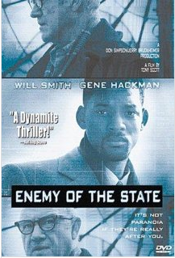

**MONDAY, JANUARY 21, 2013**

 Enemy of the state
=================

Even though I have been keeping myself pretty far away of the line that defines legal vs illegal, I still find myself thinking about what I would do if at some point suddenly I am considered unfairly enemy of state. I may be influenced a bit by movies, conspiracy theories or even my own view that as technological progress becomes faster it is not improbable that the simple knowledge, discovery of  something as simple as a better programming language (think HS) is equivalent to ammunition and in that, not improbable. orwelian future may very well make me at the target of an extermination order by the state.

So what someone like me would do if we were to be found in the same position as Will Smith or Gene Hackman in that movie? I hardly know people that know people that have gone to jail. I have no physical abilities. I cannot run, I cannot fight. I am against weapons of any sort, I consider it wrong to even learn to use one. I am in every way someone that is completely dependent on the system to survive. As I was telling to a friend that is biking to work once a week from Oakland... I will be the first one to be eaten in the zombie apocalypse.

Even worse, when my kids asked me: so dad you have been working all your life with computers, what can you hack? I sat there explaining that I don't do this sort of thing - the closest I can get is, I can very efficiently hire people that might be able to do sth like that. The kids said disappointedly sth like, you are not a hacker you are just a manager.

Having seen practically most spy movies, the ideas are obvious: keep in random places loads of cash and extra passports in various places, accounts in Switzerland, learn to disguise and have a bunch of Tom Cruise like membrane masks etc.  But how would I even get out of the country in the first place. And just creating these passports is illegal. So for me to protect me from this improbable future I would need to so sth illegal now. It doesn't make sense.

So last weekend I found the perfect way:
 - it allows one to stay in the country practically for ever, completely undetected
 - it allows for going places with car even airplane traveling (with significantly more wealth)
 - all the preparations are completely normal/legal
 - it requires no special physical skills, nor becoming master of disguise.
 - it requires no connections with shady characters
 - it requires strong cryptography
 - it does not require the commitment of any sort of crime after the evasion (besides the evasion itself)
 - like any good method it doesn't rely on obfuscation - the method itself can be "open source"

The downsides:

 - its preparations require some level of wealth  (possibly > $1M)
 - prolonged exposure in public areas may allow face recognition to detect
 - you cannot cross borders
 - you live a witness-protection-program kind of life, ie, you cannot reconnect with any resource of person of your past life

Hint : it requires knowing how to create minimal forms of _artificial life_.

_Posted at 7:45 PM_