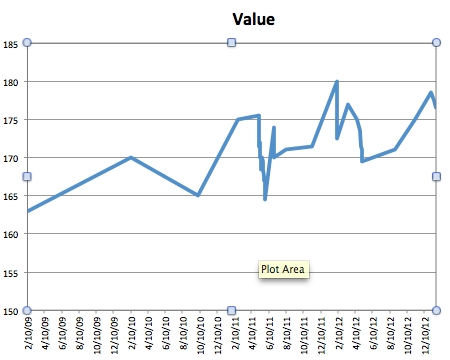

**SUNDAY, JANUARY 20, 2013**

Losing weight
=================

I want to think that I am not weight obsessed.

Still, the truth is I am weighing every day in the morning and I was very annoyed when Google Health decided to shut down: they were the place I would keep track all my health metrics/measurements. Now all this information resides in a dropbox folder, in an excel.

My justification of why I should care about my weight is that it is a proof of true aging.
I don't think that I care about having wrinkles  white hair or losing my hair. But somehow when I see my old pictures whithout the extra decades of fat deposits that saddens me.

It represents a different form of aging - not so much biologically necessary but probably representing the loss of character youthfullness, addition of bagage, un-necessary things that keep on dragging you down as you grow and make you lose your ability to dream and act the way you would when you were younger.
It is probably part of the same theory : weigh yourself and all your belongings (including mattreses and homes and antiques.. and the less you weight, the more you have in things that don't weight anything but matter, education, relationships, faith, dreams.

So here is my weight : I used to be 150lbs back in 1990 - and it seems that I have been adding half to one pound per year since.

_Posted at 9:25 AM_