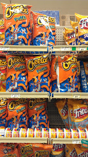

**SUNDAY, JANUARY 20, 2013**

Supermarket run
=================

My wife just asked me for a favor. To bring her, her favorite curler puff cheetos.
I thought for a second, its 11:15am I am in a good working mood, ready to do something productive.
I really wouldn't mind paying $2-3 extra and have these cheetos delivered to my door.
Still, 15+years since webvan was trying to make the revolution for online grocery delivery - its definitelly not here, in spite of safeway online and the various "runner" online services task-rabbits and such.

Maybe people don't really need sth like that. I take on my coat attempting to record every one of the by-the-minute detail that this errand means - and I could have missed/avoided had my wife taped an app at her ipad and order a "hurry-up" order for curely, puffy  cheetos.

- First feeling, its a good day, coming out of the door at 11:15am - its the first time I noticed it.
would I be missing that?

- Going for groceries is an "event" - my son shouts, get _my_ chips too, and my wife adds again - one organic milk too. That doesn't seem necessary - were there an app for online delivery, my wife would have put in the order for milk - not rush , the app would have remember the default size and brand and type of milk..  On the other hand my son wouldn't have got his chips - a more organized method for parental controls would have evolved allowing some things, in some quantities but not others.

- The five minute drive to safeway is relaxing, uneventfull. I see the sunday suburbian neighborhood activity,  smile to a few folks, see a new for sale sign... would I be missing that?

- As I drive  doubt comes - what chips does my son really wants ? my salt and peper favorite or bbq chips? Quick failed speak to text effort - succeed to ask the question the third  time.  It seems any s/m errant service would need a text communication for resolving ambiguity and such. I wouldn't miss that.

- The parking lot is unreasonably full (found out later that its sth like superball day). I have to look for a parking and driving my minivan I have to park further out - things were easier with my 15yr old smaller caravan. I wouldn't miss that.

- Right when I cross the door I cringe. Reusable bags. Not being a regular shopper I forgot. Ran back to the end of the parking lot picked by reusable bag (san jose => no free bagging by city ordinance to promote "recycling"...). I woudn't miss that. The runners being an independent third part of supermarket crew would be efficient in that.

- I go to the chips aisle. No curlers just puffs. Spent some time browsing around, managed to stay focus. Wouldn't mind missing s/m aisle distractions.

- I look at all the puffs and I smile - I bet my daughter would get a kick that mom has sent me to the s/m just for her chips. I snap a photo and text to the whole family the photo. My phone keeps on buzzing all the way back with funny comments to each other from the rest of my family.
I would miss that.

- Looking for milk - I see that our regulat brand isn't any more. As always only the safeway brand is well stocked. Anyway I know the drill, has happened before and buy sth else. An evolved service would have been able to deal with that just as well. So, I wouldn't miss that

- At the cashiers lots of people everywhere. Spent time looking for minimum queue. I wouldn't miss that.

- The lady is new. So just fake small talk and attempts to pronounce my name. I wouldn't miss that.

- Trying to help the lady in front of me that panicky sees her  credit card sucked in the sliding belt. I guess I would miss a few opportunities to be helpful, get some honest appreciation and feel good. Of course doing supermarket chores seems a very inefficient way to achieve that.

- Safeway club points, coupons. I probably wouldn't have those - nor would I care. As long as the buyer gets the club prices - I don't care about special discounts and coupons. Wouldn't miss that.

- More relaxing drive back, more appreciation of the good day, the sun, the clean neiborhood, dog walking folks etc. Would I miss that?

- As I cross the door with the reusable bag and the jug of milk in my hand, watch at 11:35am 20 minutes later - I visualize these same items sitting in front of our door right after the errand person has  rang our bell (random thought : I have never in my life asked for "help out" at the s/m cashier. It must be different than saving 20 mins of my time)

So, as I retrace my steps, it seems that I would miss a few things. Social activities, event driven interactions etc, opportunities for walk/talking to people etc. But thats wrong. Even if someone is in jail they would find a way to do decorate a definitely unpleasant experience with some social interation, smalltalks, some exercising etc. That doesn't mean that jail (or s/m errands) are a requirement for that. If you were to take all the aspects of our daily routine that are associated with "human logistics" and we are left a "sitting in front of a laptop " with an I/V plugged in , obviously this looks like a dystopia. But humans would soon create apps/services/games that give folks optional environments for interaction and to create social context, events that we care as opposed to events/process that we have to obey, and disciplines that are fully custom suited to our own intellectual needs as opposed to store hours, or physical need requirements.

_Posted at 1:31 PM_