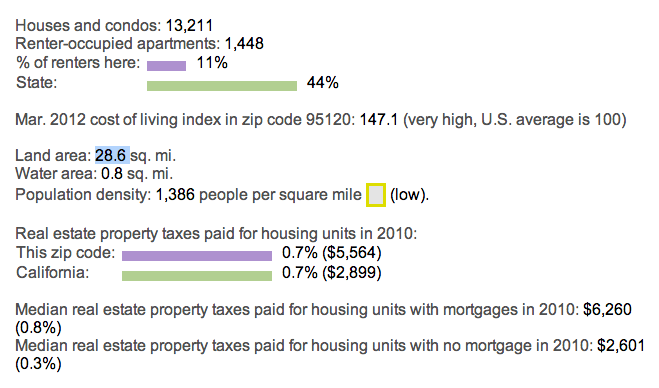

**SUNDAY, JANUARY 20, 2013**

Zip code statistics 
=================

I have always wondered about the size of my neighborhood. Its a suburb, so it is quite spread out and hard to estimate accurately using my logical "just me without a computer" methodology. It takes 5-10 minutes with the car to go from a house to another house.

I tried to find a good site with real statistics and sources by zip code or neighborhood, that would display demographic information, # of houses, population etc. I was lost in the census databases. I did find a site that is unfortunately a google trap site - but it does have the info I was looking for (its the top result in the query "population xxxxx" where xxxx is any zipcode.

So the population of my zipcode is 40K people in about 14K homes spread across 74 square kilometers

http://www.city-data.com/zips/95120.html

_Posted at 1:54 PM_