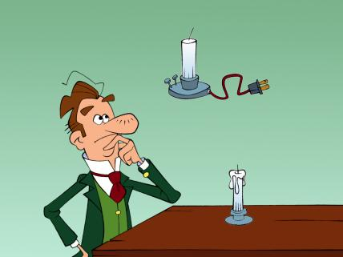

**TUESDAY, FEBRUARY 12, 2013**

Do I feel like an inventor or a discoverer?
=================

A friend at work corrected me when I talked about a new product feature that he did, he came up with.
I had used the phrase "what you discovered made a big difference"
and he corrected me saying "I would use the word invented not discovered".

My first reaction was to not pay attention, but a background thread was forked - there was something that my brain was rejecting.
I tried to understand what I didn't like.

I have never used that word for my own work. Somehow, I always felt that my work is more incremental in nature, whatever may be novel in things that I come up with are really re-trying things that have already been thought, just in different context, or for a different problem. Our textbook memories for inventors have put old fashion inventors at a much higher pedestal. But even those I often reject, as either successful corporation history rewrite/image-making (bell/edison) or just plain "people want to hear a nice story" so the most popular version of a historical record wins - independently of whether it is the most accurate... So what I mean without saying it aloud, I actually reject the old -fashioned inventors as well. I found very interesting the mathematician that solved one of the millenium problems - [he rejected the award](http://en.wikipedia.org/wiki/Grigori_Perelman) saying that the award is an insult to every one else that has added the other parts to the proof that he relied on - why the last part is more important ? why he should get 100% of the award and them get nothing?  I liked and admired that attitude.

_Posted at 9:32 AM_