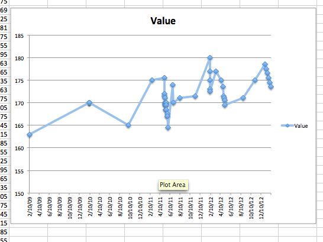
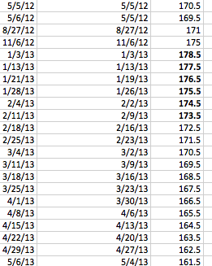

**FRIDAY, FEBRUARY 8, 2013**

Losing weight - something that works 
=================

Continuing on a previous blog post about [losing weight](../01/losing-weight.md) (ignoring the fact that it shows that I am actually more obsessed about it than what I want to think).

I think I found a method that I can reliably lose as much weight as I want.
As always losing weight has nothing to do with "diets" and chosing what food to eat.
It has to do with giving tools to the left side of your brain, your planner, to win more battles
against the right side of your brain, your reactor. So, I think I have found the right toolset.

The key is to understand that even though there are times where the reactor would win,
the important thing is to show to the planner that it is the dominant guy in a provable (to him) way and the occasional battle defeats  do not represent actual change of who is the dominant but pre-planned strategic pull backs.

Ok the theory may sound fuzzy - the methodology is very clear.
All you need is a spreadsheet.

You create a planned reduction of weight at your prefered pace. I put it at 1lb per week. Why 1lb?
- Because since my college years I added about a pound every year and climbed from 150s in my early twenties to almost 180 in my late fourties!..
- Because 1lb a week, given my sedentary lifestyle - 2K calories a day use, ie 0.5lb of fat per day use, is 3.5lbs of fat a week which means 1/3.5 reduction, ie approximately eating 1200 calories instead of 2K.  Signicant food reduction but still something that I can do in a long term, as opposed more starvation style diets. By the way not eating for a day kills 0.5lb of fat-equivalent (physics) while eating a good 4K meal a day doesn't add 1lb of fat-equivalent - human digestive systems aren't as perfectly-efficient - they can't convert 100% of the energy content of the food as you eat more and more...
Ok back to the methodology.
You pick a morning that you really would't want to see yourself on the scale. One of those days. And you weigh yourself.
You put that day down and that weight down in the spreadsheet.
You add 20 rows below with date=date+7 and weight = weight - 1. They represent your milestone goals as well as the only  history of what happens.
The first weeks goals the weight seems still something you wouldn't be proud of.
A few weeks/rows further down the weight loooks like your old diet goals
20 weeks down your weight looks like you don't even dream of. Its your weight 20 years ago. When you were young. Young and light.

So what is the trick?
You play the following game.
To make your goal for a particular date, all you need to beat that goal any of the prior 7 days, ie if my next date goal is 2/10/2013,  160lbs all I have to do is be below 160lbs between 2/3/2013 and 2/10/2013.
As soon as that happens you can proudly replace the formula "goal", with the real number.
Then you have a few days to celebrate. You actually have more than a week before the prospect of the new deadline weight appraches.

This is how mine looks so far:

I started the "method" right after new years - at what is typically my annual peak.
I have here the complete download of weight history from my old google health account.
(its probably a uniquely identifying fingerprint.... should I worry about that? nope)
The 6 bold readings (6 last dots in the chart) are the ones from the methodology - I mean they have actually happen. They appear perfectly spaced because in some way they are fabricated. I post them at week intervals even though each may have happened a few days before, or they may even lower in reality.
But I am ok with that conservative history rewrite. My planner is. The future #s are obviously just goals/formulas.

Again, the reason that this works is that often context, environment, emotional state, a dinner with friends, someone making your favorite food, make the "reactor" strong - impossible to beat that day.
But the planner has control most of the time and all it has to do to win the game is find a time when the reactor is weak, take advantage of a "good" day or two and obtain the proper reading.
The more wins are accumulated the reactor becomes more defeatist the planner more confident.
My planner is already sure (under the illusion?) that this really works! He is writing a blog post about it for crying out loud!. And in reality the game is "setup" the first weeks are very easy - very easy for the planner to win - normal weight flunctuates several pounds based on when eating , drinking etc..
The more you go into the game the harder it gets but the planner has already developed a winner's attitude/confidence. And the planner does have dirty tricks to play. I know that worst case I can starve for 24-36 hour prior to the deadline and the resulting liquid reduction can create an low to save me.  (for  me 24 hrs with no food brings me down ~4lbs, the next day a couple more.)

So it works. I am absolutely sure about it.

_Posted at 11:01 AM_