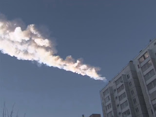

**FRIDAY, FEBRUARY 15, 2013**

Meteorites and nuclear bombs
=================

As I was reading about the [meteorite in Russia](http://www.reuters.com/article/2013/02/15/us-russia-meteorite-idUSBRE91E05Z20130215)

I read few things.

    * That it was a rock probably from iron weighing about 10 metric tons
    * That it was flying at 17Km/sec
    * That the energy unleashed was comparable to that of a small nuclear bomb
    * That in spite of earlier reports it was not the near-miss "olympic pool-size, 40-sth meters" bigger meteorite that passed 20-30K kilometers away from the earth

So, again using just memory,  from middle school physics kinetic energy is 1/2 * mass * velocity^2.
That means that 1 kg flying at that speed would have 1/2 * 17^2 about 150.MJoules.
and 10Ton => 1.5TJoules

Now, one thing one can remember is that when we talk about nuclear weapons  we talk in terms of kilotons or megatons. That means kilotons of a conventional equivalent bomb. Now, one thing that I didn't know but I am making from now forward a permanent datum that will not forget is that the formula is practically identical to calories - that I do know!
1 calorie ~ 4200Joules  (actually 1 calorie being the energy needed to raise 1 gram of water 1 celcius is 4.2 Joules, but the calories that everyone is talking about 2000 Calories per day etc, these are really KCals.)
Anyway the point is that 1 gram of TNT bomb is also the same as 4200 Joules
which means that 1 kg => 4MJoules
which means that 1ton => 4GJoules
which means that 1kton => 4TJoules.

If my memory recalls well whenever I hear about nuclear weapons I think I remember kilotons (maybe megatons).  If this meteorite were a 10 metric tons in size, its kinetic energy would be 1.5TJ ie, about 1/3rd of a kiloton bomb- so the "small nuclear weapon" comment seems about right.

What would have been the impact of the olympic pool 2^3 vs 40^3 thats a difference 10^4.
ie the pool-sized meteorite would carry energy (assuming same speed) of 3Megaton instead of .3Kton.

Time to do [wikipedia check....](http://en.wikipedia.org/wiki/TNT_equivalent#Examples)
	* Cheliabink Meteorite : .3 kton
    * Small Nuclear bombs : .3 kton
    * Hirosima bomb: 10kton
    * Olympic Pool Near miss meteorite 3Mton
    * Large Nuclear Bombs : 5-10Mton
    * [Tunguska event](http://en.wikipedia.org/wiki/Tunguska_event) meteorite : 10-15Mtons
    * Surface energy of 2004 tsumani earthquake 25Mton
    * Largest ever nuclears : 50-100Mton
    * Dinosaur extinction meteorite :  100 million megatons of TNT.

Its impressive how big our nuclear weapons are - if I havent done a mistake they are ahead of major natural disaster events... It is also impressive every 10-times up (in terms of diameter), thats obviously 3 orders of magnitude more energy, and from a 2-m diameter cheliabink meteorite, the 20-meter size would have been an tugunska like event (like a mega nuclear bomb somewhere), and a 200 meter sized could have been something that would take humanity decades or more to recover, and a 2K meter event could have brought extinction.

But now the other question, about the olympic pool meteorite :  30000 Kmeters (about 3x the earth's diameters) really seems a tiny distance.  Why isn't it being pulled by the earth's gravity? Can we figure this out by memory?
and the 17Km/sec seems terribly close to my memories of "escape velocity" (11Km/sec? )

Ok geo-synchronous satelites cause .2-.3sec internet delaying => 30-40K kms distance from earth (light speed = 300K km/sec). That gives us measure to compare against without having to remember the hard to remember gravity constant. Ie sth that flies at the same distance as the geo-synchronous satelites would need to be flying faster to escape or less to be captured. And given that the geosynchronous are geosynchronous we can calculate their speed....40M meters from earth's center time 2 time pi is the circumference and 86400 is the period 40K x 2pi / 86 = 1K/pi = 300meter/sec!... (that looks so slow!!)
so clearly 17Km/sec  is too fast to be captured by the earth's gravity... and that also explains why we don't in general capture big stuff flying by... they need to be much closer...

_Posted at 2:23 PM_