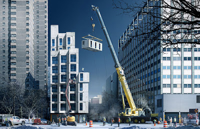

**SATURDAY, FEBRUARY 16, 2013**

Micro-appartments 
=================

I just started reading this post about [micro-appartments](www.fastcodesign.com/1671701/micro-apartments-give-a-hint-of-city-livings-future#1)

and I remembered a friend that was telling me that he hopes for a future where University-like dorms would be the norm.

Here are the elements he was looking for
 - he doesn't want to think about eating and food - besides the selection of a walking distance restaurant or menu item
  => no real need for kitchen
 - he doesn't want to have complex accounting, taxes, tax exemption, brokers wills etc
  => he doesn't want to own he would rather rent - without a long term lease..
 - he doesn't want to think about house upkeeping, whether this is fixing plumbing or even the weekly cleaning chores
  => he wants an apartment as opposed to a house, and ideally one whose maintenance is straight forward
  => when you take out major appliances, and leave practically a small studio maintenance becomes much simpler and cleaning more efficient
  => the moment that you eat out storage needs drop significantly
  => the moment that you opt to rent you have less options of customizing less owning things => less storage
 - he wants to have at close proximity with variety of areas that provide silence, views, good food, good coffee, concentration, social interaction, lively-ness.
  => The more tightly you pack people and the more you remove these spaces from the living quarters the more they emerge as shared areas that still provide all the requirements but get better use and are more efficient in their upkeep

After reading the article's first line I think that the future that he (and at least in theory I - since in practice I live the exact opposite suburban life) hopes for is nearer.

_Posted at 2:19 PM_