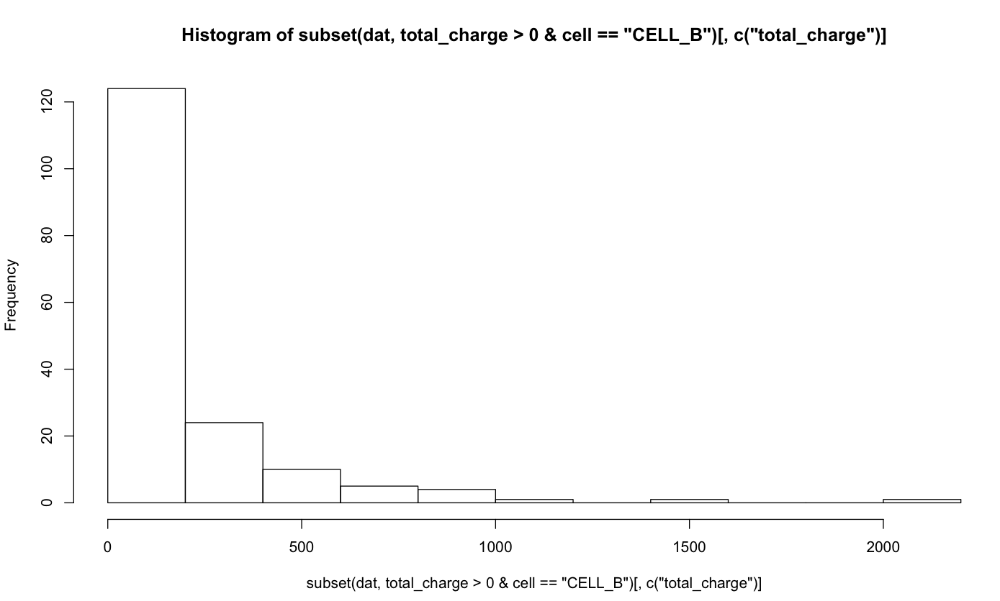
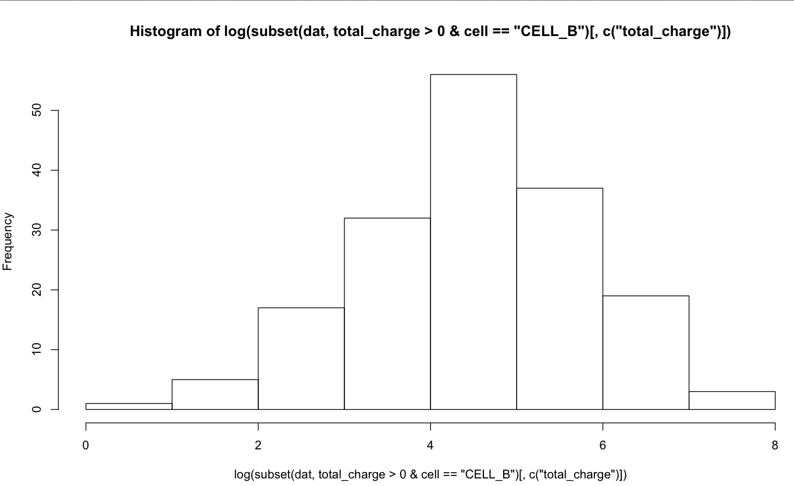
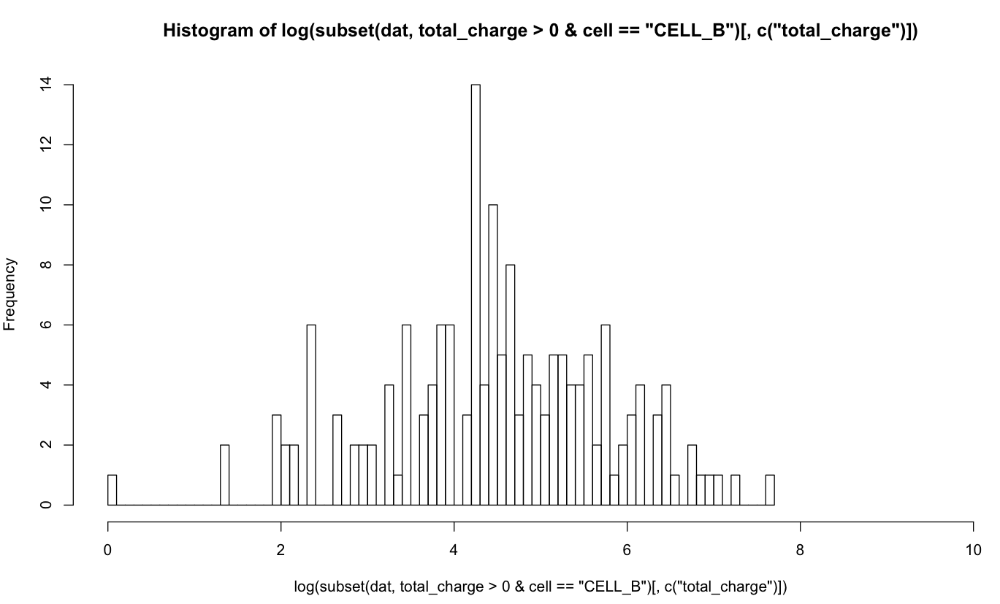
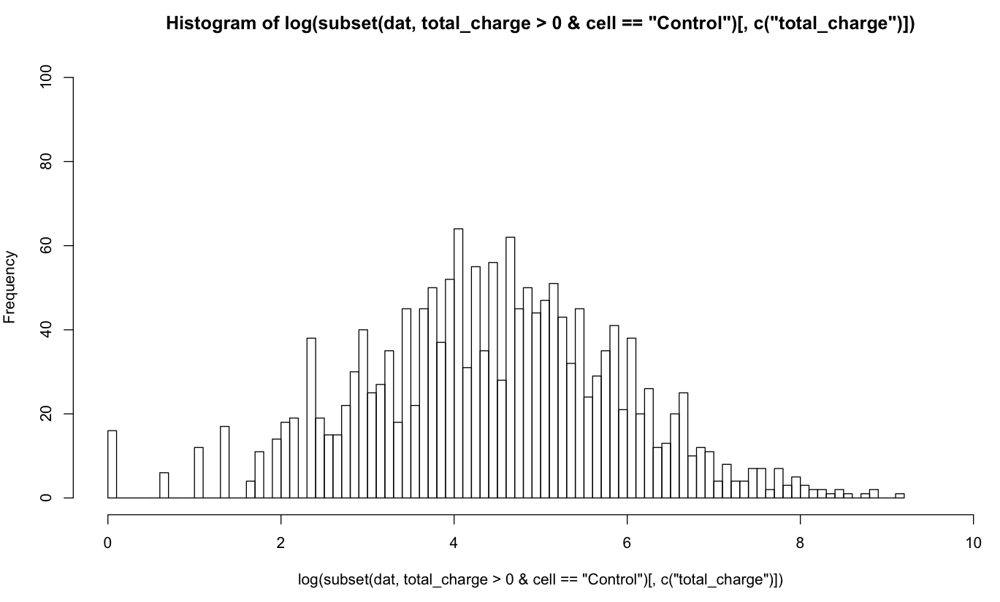

**SUNDAY, FEBRUARY 3, 2013**

Moving from SQL to R
=================

I wanted to get to see the distribution of dataset, something that would show whether there is something abnormal in one of my datasets.
I decided to use R for that.
I have already R installed in my mac - using more like a scientific calculator than anything else.

First question getting the data into R. I found some examples that show how to do that from csv files but I decided that it would be better to be able to run the queries right from R.

Apparently R doesn't have any builtin support for databases so you need to install additional packages for that.
After following a few wrong posts, I found that there is already a CRAN (like CPAN) with all the R packages, where I found the name of the postgreSQL one.
Trying install it gave me dependency errors. I couldn't find some way to ask R to install anything that it needs recursively. Here is the resulted manual list:

```
----Adding  DB Drivers
Add MySQL, Postgres drivers
> r
install.packages("rJava")
install.packages("RJDBC")
exit
> R CMD javareconf

> r
install.packages("RMySQL")
install.packages("RPostgreSQL")
```

I had to exit and run the javareconf command - otherwise it wouldn't work. Still after that 30 minute exercise I had both postgres and mysql drivers.

<pre>
library('RPostgreSQL')
drv <- dbDriver('PostgreSQL')
db <- dbConnect(drv, host='some_host', user='some_user', dbname='some_db', port='some_port')
dat <- dbGetQuery(db, 'select 1')
</pre>

The next problem I faced was that my queries are pretty long 20-30 lines of sql code full of quotes and double quotes. What is the simplest  way to paste a 30 line text in R. I couldn't find any quoting mechanism for long literals like """ for python. The only way I saw was a method for inline standard input with scan(). However, this has the unfortunate side-effect of adding every single individual line of the standard input as part of your command history.  So I ended up deciding that the most normal way would be to use a standard "scratchpad" file where I paste the queries and I read  and execute:

<pre>
s <- paste(scan('~/Dropbox/Home/tmp_query.sql', sep = "\n", what = "character"), collapse = " ")
dat <- dbGetQuery(db, s)
</pre>

Ok, at last I have the data in R. The data are lots of row, where each row has a numeric column that I want to see the distribution of. Something that I expect to look like a bell-shaped curve. 

The first problem is that the query brought more columns than needed and the result is actually having 4 data sets in it denoted by a column whose values are `CELL_A,..CELL_D` or the four datasets (its the result of a group by). I can start doing all the filtering/selection in SQL but it would be nicer if I learn how to do this in R.
It seems that there isn't any best way of doing it.
I tried first matrix manipulation option:
<pre>
dat[dat$cell in ('CELL_B') & dat$total_charge > 0, ]
</pre>

but that results in lots of NAs and removing them makes the expression even noisier:
<pre>
dat[dat$cell %in% ('CELL_B') & dat$total_charge > 0 &!is.na(dat$total_charge), ]
</pre>

Using the subset operator creates a more compact expression:
<pre>
subset(dat, total_charge>0 & cell == 'CELL_B')
</pre>

and after that picking the right columns seems very natural:
<pre>
subset(dat, total_charge>0 & cell == 'CELL_B')[,c('total_charge')]
</pre>

So, at last we have a single vector with all the right values. The next step is to create the chart.

Lets just try hist on it:
<pre>
> hist(subset(dat, total_charge>0 & cell == 'CELL_B')[,c('total_charge')])
</pre>



maybe applying a log function on the data before plotting them would make them look better:
<pre>
> hist(log(subset(dat, total_charge>0 & cell == 'CELL_B')[,c('total_charge')]))
</pre>



Better!.
After playing with a few of the parameters I got what I was looking for:
<pre>
> hist(log(subset(dat, total_charge>0 & cell == 'CELL_B')[,c('total_charge')]), xlim=c(0,10),ylim=c(0,14),breaks=100)
</pre>



Unfortunately, it is still rather discrete. And I would like to be able to place it against the 'Control' data set



Looking at the dataset doesn't give me a clue for what I was looking for. Besides a stronger intuition that the CELL_B dataset is too small to allow meaningful eye-balling understanding.

Need to read more.

_Posted at 2:29 PM_