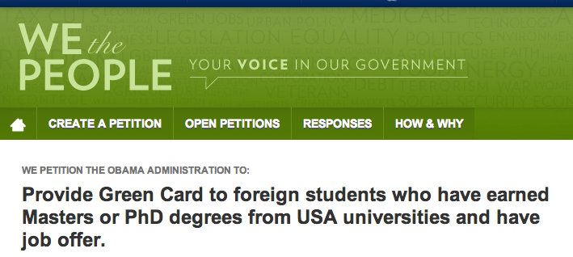

**TUESDAY, FEBRUARY 19, 2013**

Politics and why I don't like them
=================

A friend sent me a [white house petition](https://petitions.whitehouse.gov/petition/provide-green-card-foreign-students-who-have-earned-masters-or-phd-degrees-usa-universities-and-have/RD1s6V8y). It was one of those well intended petitions that
 - has no chance to ever be voted for
 - are so flawed that they would cause more damage than do anything good
 - they are so naive that makes you wonder about the person that authored them

Of course like everyone else, I didn't read the petition, just read the title, agreed with its intentions and given that I knew and respected the person that forwarded it to me, I did the obvious thing.

I signed the petition and shared it at my google plus urging my followers to do the same

.. and perpetuated recursively the stupidity...

Sucks.

--- pasting arguments from follow-on skypes

> [http://www.internationalstudent.com/study_usa/choosing-the-usa/usa-education-system/graduate.shtml](http://www.internationalstudent.com/study_usa/choosing-the-usa/usa-education-system/graduate/)
Every year 500K people are awarded a masters degree. and 45K a doctorate degree.

- We all know that everyone can get a job offer if they really want to - so thats not a true filter - it is just there to create the illusion to the petition signers that we don't bring people to the welfare state....

- This would mean that If US were to accept the petition above for Masters degrees an "Accredited University" industry would be created that would allow people to get Masters degrees - essentially a 10-20K/1yr for a green card. These universities would be most probably online and would very probably remind you some of today late night advertised online universities)

- This would mean that foreign students that currently can easily get a student visa would be limited/restricted at the get-go.

_Posted at 7:40 PM_