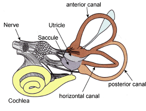

**MONDAY, FEBRUARY 18, 2013**

Sensing gravity
=================

As I am standing up typing, I notice the usual back and on forth swaying on top of my feet. It is not fully intentional, neither tiring - but the more I focus on something the more it happens.
So I think that it happens for a reason:
When you sway your body does the following game : it lets your body completely loose to slowly follow a  locked-knee free fall but it fully monitors the body's inclination not from the ear's labyrinth (my head is locked - aligned with what I am focusing on) but from the extension of the feet muscles. Then when it reaches a certain point of imbalance  (calculated based on muscle memories) it tense the necessary muscles to rebalance the body.
It seems that the ear's signal is much more coarse in nature, (I can tell 1cm movements of my head, with my eyes closed, ie 1*360/(180cm * 2* pi) = less than 1/3rd of a degree in angular position from the vertical. A small organ (labyrinth) that relies on sensors millimeters apart (hair cells) seem improbably to be able to detect that.

It is also interesting that while the ear's balance signal is coarser - it indicates grander imbalances and thus when the brain gets two conflicting signal (feet muscles saying we are in balance, and ear saying we are falling (when you rotate fast and lose your balance for example), then the brain listens to the ear - not the the muscles (and  thats why we lose our balance and fall after self-rotating).

_Posted at 9:24 AM_