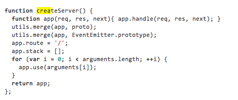

**MONDAY, FEBRUARY 18, 2013**

Twisted code 
=================

This is a piece of code from the node.js [connect framework](https://github.com/senchalabs/connect/blob/master/lib/connect.js):



Note that function:

```function app(req, res, next){ app.handle(req, res, next); }```

Any guess what the it does?
It took me and my friend half an hour...
You define a function which the only thing that it does is call a non-existent function on the fuction's own pointer passing its parameters to it!!.

utils.merge is a generic array merge function
proto is the result of a require('proto').
Ah and right after the function above the code does

```createServer.createServer = createServer;```

The answer is that proto is a module that defines a set of functions that are each attributes of an object.
like
```
exports = module.exports = {
  use = function (foo) { },
  handle = function (boo) { }
};
```
As a result what the merge does ... is a dynamic blessing of on object to obtain the methods of an predefined interface : it assigns to the function pointer methods like "use" and "handle" that the function mentioned at definition time - but still its not execution time yet... this delay doesn't mean anything.

Of course, still knowing what the functions does... doesn't mean that we really know what it does ... but I am a step closer now.
In particular I don't understand how someone decides to put some part of the code
in a function method (e.g. handle and use) vs function body "function app(...) {   } "
and why the definition of app isn't in the proto file itself.

_Posted at 4:25 PM_