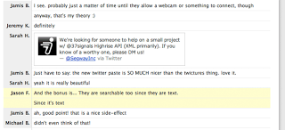

**TUESDAY, FEBRUARY 19, 2013**

typealone.com 
=================

I realize that several of my posts (all the work notes for example) (and the posts of a friend I follow) are in the form of capturing what I do, so as someone else (or me at a later point) can follow what I do, why I did it etc.

However, as a reader I am missing an important thing : the actual timing of the event.
Given that these work notes are being written in draft form in real time and then published - either when  reaching a milestone or in my case published several times - the blog could have captured the timing of the progress. Thinking it again what I need is something like skype,  where everytime I type I get the timestamp. I chose what I will include as a single chat message (one timestamp) or multiple.
Of course skype is adding all kinds of un-necessary information and has been increasingly worsening in its use from a developer... more and more substrings become emoticons, copy-ing and pasting from skype is a disaster (unless you do it in a very specific way ) etc etc.
Campfire was nice - it also had the nice property for auto-paste-bin-ing any large multi-line paste.

So, this is the service that I would need
typealone.com

Features
 - Condensed, customizable timestamping
 - Real ACE-like editor while writing every text message
 - Auto-save for every message.
 - Edit of any prior text - without messing up the timestamp
 - Option to time both the beginning of text typing , time of first submission vs time of last edit.
 - Developer friendly copy/paste
 - When pasting large things - ask for paste-bin-ing (configurable pastebin/gist etc). allow choice of # of lines displayed embedded etc
 - Allow any selection to be code formatted - using language specific highlight - do auto-guess of that for pastes
 - Allow unguessable urls that display any fragment of the typealone
 - Allow public urs to any point in the typealone tape.
 - Allow wiki-like anchor links (so as you can point from one place to another in the tape..

Hmm, I think I went from a simple utility to allow me to write work-note like posts (that are eventually copy-pasted to your blog) to a standalone service... Not clear what is the purpose of typealone anymore...
Anyway that was all I thought about it.

_Posted at 11:44 AM_