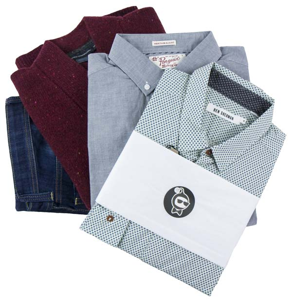

**FRIDAY, FEBRUARY 8, 2013**

What to wear
=================

A friend just mentioned that he got a subscription to [bombfell.com](http://www.bombfell.com/). And people in the office realized that they had recently been complementing him for improving his dress style, apparently as a result of the bombfell's "personal consultant's" taste.

I think its pretty cool not having to worry about what to wear. My only fear is whether the increased choice of options in the closet will make it harder and harder to pick what to wear. I have been personally looking for a "subscription" model for identical clothing replacement. Amazon doesn't have subscription for some of the "commodity" clothing items:

I have been always wearing a particular fit of Levis jeans, and my only sport shoe has been an Adidas model that has been around for 30 years. I buy them in batches and when they become too old, I grab a new one from the box - if its the last box I reorder. 

I have a problem with the non-sport shoes - there is now way to find/point to the specific Timberland brand/model I have been wearing even though its practically the same for the last 10+ years. As for shirts, I had big supply of black company logo-ed shirts bought with a coupon from marketing... But unfortunately marketing changed the logo and they are not happy with me any more wearing the old ones...The new ones have no black, and thats too big of a cloth change for me for my winter jeans+black shirt outfit. Socks etc, are being replenished automatically by themselves. (my wife)

_Posted at 1:14 PM_