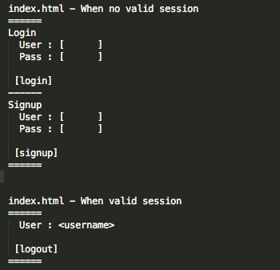

**TUESDAY, FEBRUARY 19, 2013**

Work notes - loginator 
=================

Its time to move to the target app - the "loginator".
A simple application whose sole purpose in life if to allow signup, login, logout. My expectation is to
- use passport
- use sessions

When I am done after that I want to see how easy it will be to make the app a facebook connect like js plugin for other apps of mine.

By now creating heroku, github etc is pretty straightforward - I don't even need to read my old notes:
Here is the list of relevant links:

- Here is the github repo : [https://github.com/ogt/loginator](https://github.com/ogt/loginator)
- Here is the heroku app : [http://secret-sea-3866.herokuapp.com](secret-sea-3866.herokuapp.com) (20+ sec delay at first fetch)
- Here is the blog post about this : [http://otdump.blogspot.com/2013/02/work-notes-authentication.html](../02/work-notes-authentication.md)

Here is what the app should look like:

_Posted at 7:32 PM_