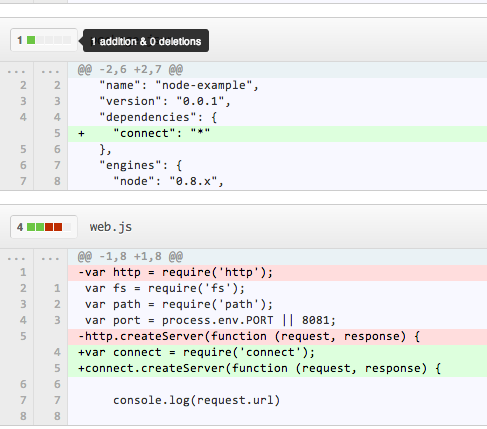
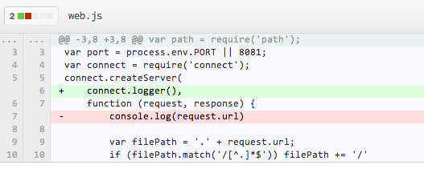
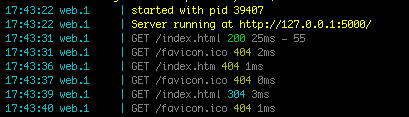
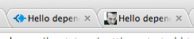
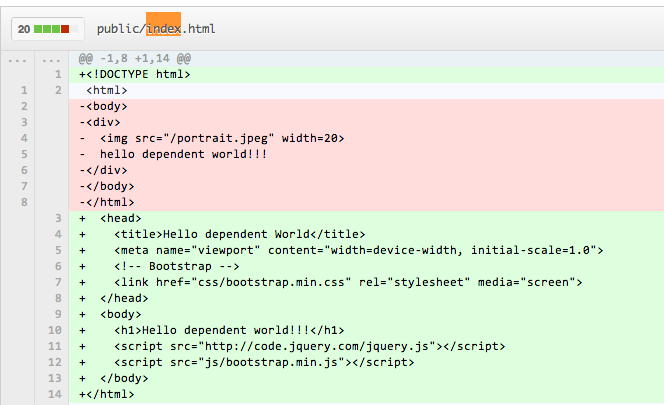

**MONDAY, FEBRUARY 18, 2013**

Work notes - using middlewares
=================

Ok,
It seems that my [simplistic web server](https://github.com/ogt/helloworld-js-heroku/blob/master/web.js) is the perfect vehicle to help better understand middlewares in node.js. I understand all its pieces, and its obvious that every part is minimalistic/not sufficient for a production site,
 - logging,
 - mapping of url space to local filesystem directories,
 - handling of default files,
 - handling of content types,
 - handling of error responses,
 - handling of HTTP headers.

Each one of these represent a few lines of code in the 50-lin web.js files.
So what I think is an interesting exercise is to incrementally replace each one of those things with a connect middleware and see what changes need to happen in the process and what is left over in the end. What I am expecting to get from this exercise is
 - a more robust, production-level hello world
 - a better understanding of connect, middlewares
 - a system that I can add in the next step basic authentication, session management to build my simple utility app that I set as my goal.

Before proceeding a decision, should I continue working on the existing repository?
Hm, the blog points to the files, but I can move the files as "examples". But the heroku setup (package.json, etc ) is what it is because we have no dependencies. Hm., it seems that in node.js/heroku the natural unit is the repository. Then I guess I will have many repositories, possibly one per blog post.
I should probably go back to the last post and leave a link to the repo + a link to the heroku app.
Done - Added links both in the repo's readme and in the blog

Creating a new repo - I guess the folder's name is important - it will be the repo's name using our hub create method.... copying all files in. and back into connect documentation.
Actually lets first try and make sure that everything is working fine before any changes - not very confident yet that I have mastered the create repo/github/heroku thing....
Ok following the previous steps

```
> # created a copy of the folder files with new folder name... 
> # from inside that folder

> npm install
> git init .
> git add . ; git commit -m 'init'
> hub create
> hub push -u origin master
> heroku login
> #test foreman start..  open ...
> heroku create
> git push heroku master
> #test open ...
```

I have now :

Here is the github repo : [https://github.com/ogt/helloworld-js-heroku-depends](https://github.com/ogt/helloworld-js-heroku-depends)
Here is the heroku app : [http://guarded-stream-2218.herokuapp.com/](guarded-stream-2218.herokuapp.com)  (20+ sec delay at first fetch)
Here is the blog post about this : [http://otdump.blogspot.com/2013/02/work-notes-using-middlewares.html](../02/work-notes-using-middlewares.md)

First step see what it takes to use the connect createServer without any of the middlewares.
Hopefully it will be exactly the same as using the http's createServer method.
Making the following changes in two files (not very sure about what version I should use for connect..)



then running
```
> npm install connect
> #test foreman start.. open
> git add . ; git commit -m 'replaced http with connect'
> git push origin master
> git push heroku master
> #test open ..
```

and everything is still perfect besides the massive upload of dependencies to our github repo.
Next step, lets replace the loggin command in web.js with the logging middleware.



I will actually use  logger('dev') formatting option to get the color highlighting in my terminal
Next step, lets try to remove the error handling code.

Hm.. the error code seems intertwined with the file service code... may be I should do that first.
Apparently I will need to move my index.html file under public and set public as my static file serving folder.  Ok, I did that and added

```
+ connect.static(__dirname + '/public')
```

as well. Things work, and it seems that they serve off the public folder. But it worked so smoothly.. I am not sure. I start removing lines from the web.js and keep on testing it.
 - removed the contenttype code , still it works
 - removed the error handling code, still it works
 - removed the index.html defaulting, as well as the mapping to file path code... still it works
 - removed the complete function we added to createServer... still it works

```
var fs = require('fs');
var path = require('path');
var port = process.env.PORT || 8081;
var connect = require('connect');
connect.createServer(
connect.logger('dev'),
connect.favicon('public/favicon.ico'),
connect.static(__dirname + '/public')
).listen(port);
console.log('Server running at http://127.0.0.1:'+port+'/');
```

At this point I started having doubts... could I be testing the wrong site - it seems to be working no matter what I do. I renamed index.html in the folder. I get an error. Maybe I should add an image to my hello world to make sure that the content type is set correctly.. did that still it works.
With every fetch I keep on getting the error code for the favicon - I haven't done anything about it... so I know the error handling works. Also I see a 304 ... what is that... it seems that the static middleware is "smart" and returns a "not changed" status code instead of resending the file every time..



Could that be it? I refresh the browser with Shft-Command-R and I get 200s!! Perfect. Everything works perfectly.

Maybe I should just fix the favicon as well. I think I saw a middleware for that.

I add it. The error disappears in the log. But no other difference. I should be seeing the "default connect icon". Don't see it. Maybe I should set a custom one. How to do that... found an online convertor.. convert my portrait to an icon and save it as favicon.ico. No diference. Maybe its because its in my localhost? I push it in heroku. Refresh and now I see it. I have been looking at the wrong place....all this time - the favicon is at the browser tab - not left of the url input box.. What was I thinking...



I push everything to github ([commit](https://github.com/ogt/helloworld-js-heroku-depends/commit/ba52eaf35867ac3c115693e280914aed42d9f647)).

I think I am almost done. Maybe I should add some decent css.
Need to use something modern.. Was it blueprint? compass? bootstrap? I browse a bit before I conclude   to bootstrap..  download the files copied them under public and with a couple small changes in the index.html file



we are done at last!!  ([commit](https://github.com/ogt/helloworld-js-heroku-depends/commit/3718ccc4f57d15ae5eae92ccd9406cc2cf4e6de7#public/index.html))

_Posted at 10:13 AM_