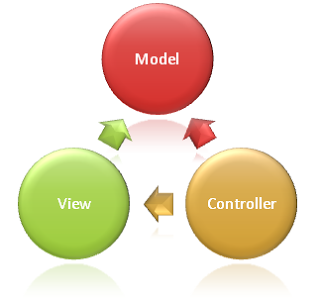

**SATURDAY, MARCH 2, 2013**

A friends silent anti-mvc manifesto
=================

The last couple weeks I have been (trying to) follow the coding style of [dglittle](https://github.com/dglittle). 
His coding ideology is similar to many developers I know, write simple code, have few dependencies be ready to throw away the tools you learn yesterday to use the tools of today, make your code something that you enjoy to see and visit etc etc
Still, the resulting coding style and practices are rather unique. I actually don't think I have seen any developer who writes code that involves user interfaces and databases and external services and everything else in between writing programs like that.
There are several unique (and occasionally extreme - e.g. against my advice he has been using he own hand handwritten persistent store) elements - but one in particular that attracted me was that I don't need to think about MVC when I read his code.

His code has a clear architectural line between server and client but besides that it does not attempt to break apart the presentation code in a typical mvc way. My thing with mvc is that for whatever reason, possibly because when I heard of it for the first time all the good brain cells were already gone... so it never made deep into my skin. But instead of admitting my intellectual difficulty, I find it more attractive to think - my brain must be rejecting it for a reason - it attempts to impose some structure where I don't need one.

Anyway, here are some of the design patterns I see in dglittle's code:

    * Do not use server side template engines - let the server serve exclusively static assets and restful APIs. 
    * Store structures as they are in the language - to minimize coding complexity. The DB's role is simple to persist as unobtrusively as possible the app's main memory structures. This implies that the app is responsible for any indexing (just like it would have done for memory structures), but it is free from any data-conversion/copying etc..)  (Note that you don't see anywhere a model in the server side - unless they it sense as part of the API definition)
    * In the client side make server rpc calls as similar as function calls as possible. They are still asynchronous but there is no parameter/ret value value differences from normal functions. An underlying library maps parameter passing to json objects and handles gracefully error handling/exceptions.  
    * In the client side 
        * separate with naming scheme functions that 
        	* calcuate/return dom objects from 
            * functions that actually do manipulate the browsers document
        * push DRY-ness by functionalizing any repeatitive HTML source
        * use jquery parsing to make html constructs look more natural if you need to escape code strings etc you are doing sth wrong
            * onclick functions should be functions
            * dom text value should be strings
        * Use functional nesting to keep related code together
    * Besides that use whatever linguistic pattern/convention you see fit to create a reusable/maintainable code.

Suffice to say that I can't tell where are his controllers his views and his models and neither do I miss any of that..

_Posted at 11:43 AM_