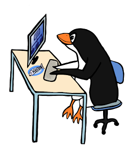

**THURSDAY, MARCH 14, 2013**

Adding pictures to my repos 
=================

I started full of excitement to [add a picture in each one of my public repositories](../03/node-and-learning.md) (note: [I am talking about my hello world steps here](http://otdump.blogspot.com/search?q=helloworld)). Sticking random pictures that I find by searching google-images - the way I do with my 10-minute-labor blog posts - didn't seem right. Repos represent minimally hours/days or more of work. They are worth a bit more attention. So I tried to find something better.

Clip art galleries gave some ideas.. but they all would require some level of synthesis from my part.. And I am a really incompetent illustrator.

Darn, what I do? I actually know what I want. I want to follow the style/brush/color of the [substack guy](https://github.com/substack/node-browserify/blob/master/readme.markdown) and use it to make a drawing of a bear ([I actually found a picture of a drawing of a bear that I liked that waves hello](http://goo.gl/uvDHG)) for "hello world" then that bear eating milk and cookies for hello world with cookies, then that bear holding something that looks like the standard  "disk-drive" clip art that we use for databases - holding and scratching its head in a "what the heck is this" face.

As I play it in my mind - I actually want less of the personal style of substack - and more the typical cartoon style. ... looked a bit around I found some pictures of what _I_ think as "typical cartoon" style.

Thats better - it actually lends better for all my future ideas - they will all be this particular cartoon style - I can make it my personal style.

And now - what? What would I do ? I guess I would have to postpone the task for whenever I have time to hire an cartoonist at OD to do the job for me.. this probably means never.. Darn.
It would be nice if every time in the past that I have thought about a cartoonist marketplace - I had actually done it..
But even if I have ever build a cartoonist marketplace it would be dead by now - I haven't found (yet) the elixirium of life for my tiny startups - they only live as long as I breath air in them - they just die after I let them alone - abandoned from lack of use.

Plus it would have been different - My previous idea had something to do with "sticky figures".
This time my ideal service would be one where I point to an existing drawing give a few instructions and I get back within a few hours for ideally $10-20  the drawing of my liking.

Lets write-it up:

The service works in the following way:
  o You find some illustration that you like (input #1)
  o Then you provide some text instructions (input #2)
    (e.g. use same style, brush, colors etc but draw the person running after the bus instead of waiting for it.
  o You can use links to other pictures here, or you can add a photo of sth that you drew - from sticky figures to anything else.
  o A possibility here is that you are restricted in terms of what you can say - essentially forcing yourself into a very incremental process.
  o You pay for a just single step transformation. You always start with a drawing and you change just one aspect of it.
  o The drawing has to be a drawing in the existing collection - which means that we need to be saving/reusing the vector graphics - that gives a nice network effect
  o The drawing isn't owned by the user (its owned by the service)  - the user just gets a non-exclusively license to use the jpg/png version of it as they see fit.
  o The site gives examples of good "iteration steps" and bad steps.
  o The content isn't just the images - its the before and after... (maybe its worthwhile to expose the artists after all)
  o The site charges a minimal amount per step (e.g. $5) and enables short TAT (e.g. hours)
  o The jobs get auto-posted/autohired in odesk with the right picture / request / TAT
  o Requests that are complicated shoulld be send back with the suggested steps analyzed.
  o Starting from a fresh externally provided picture adds $50 to produce the vector graphics

Another alternative would be for the service to provide real time interaction ... Thats actually a rather different idea..
  o Seeing the person that you hired drawing it - is what you often need - you don't know what you mean until you see it.
  o You actually buy 5-10 mins of someone that you control with a chat.
  o In this case you can actually see how fast people have drawn what...  the content isn't just the before after its the complete screencast recording of the drawing happening

Hm... maybe I went overboard...

Lets go back to where I started..

_Posted at 9:39 PM_