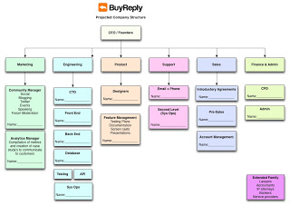
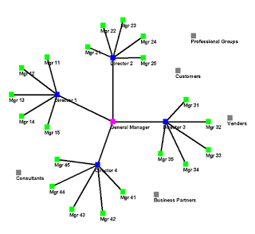

**FRIDAY, MARCH 8, 2013**

Flash startups thought stream 
=================

A friend mentioned yesterday that he is interested in flash startups.

The first question I asked was - what do you mean by flash startup?
A startup that takes minutes? hours? days? months? (note that there is more than an order of magnitude degree of separation in these definitions.)
I think he assumed that I was not serious about the "minutes" (I was)
He answered. Hours. Creating a startup in a few hours.
He proceeded by explaining how one for example can go for napkin-drawing of an interface to design, to a prototype to a real product probably in hours by using on demand pools of available experts.
I was a bit disappointed. I do get disappointed when I don't hear fresh - when I hear what I expect to hear. As another friend was saying I find it rarer and rarer to hear a truly fresh though.  And I feel an increasing intellectual hunger and disappointment - the sort of disappointment that you feel often after movies (or for people that read books books)... as you find it harder and harder to be surprised, pleased.
Anyway I am afraid I am finding this increasingly with people. 
Back to the discussion. I was disappointed because 
a) he didn't jump to the seemingly impossible goal of doing x in minutes (as opposed to hours/days)
b) he didn't jump to the truly harder goal of building a company with a possibly scalable business model(ie a startup) in minutes and instead focuses on writing software faster (the napkin design to product cycle)

When you press the boundaries - only then you can see truly inherent obstacles - problems - only then you can really come up with something revolutionary. And someone that is in research (as the friend in question) has all the excuses to do exactly that. Anyway I am probably too hard on the guy - good thing he wont read this post.

Anyway its not that I have the answer I don't even have a question.
I do have a thought stream - its a bit amorph still so it may be fully readable... Maybe if I were to add some pictures it would 

**--thought stream begins--**

I see an org-chart - which has a CEO at the top, VP of prod, eng, mktg, cfo, vp ops  next layer, and within each department I can see a whole subtree of roles and positions, ops->cust support, billing, Mkg-> PR, SEO, SEM, Copy, Eng-> Deve->front/back, QA, IT,  etc etc..

The org-chart isnt though static as above but it expand from a single node outwards.
You can think that you ask the question if I wanted a single man startup what would that person's role title be ? E.g a product guy? or a sales guy or a developer?
How about if I had 5 people how I morph my org chart? would I move out like star - maybe not,  I would probably keep the CEO/Mktg/Sales/VPEng hat and put 4 folks under the engineering as  developers or I would stay as the sole engineer (e.f. a CEO/Eng*) and add one Ops person and one Mktg person - because it hard to find someone that is good at both of these.

Think that you have the full understanding of this tree, ie the roles that various kinds of startups may need up to the side of a few hundred people. You understand their roles, their outputs and you can answer easily the question "If I have a company in that sector and it has X people tell me its most probably org- chart - where all emloyees/contractors are?". Assume that this knowledge is so well understood that it can be captured in a program. Now assume that you can hire on demand any kind of talent  that your orhchart refers to from "CEO and CFO to copy editor to one man legal dept... and not only you can hire them on demand but you can rent them for a rather short amount of time.

The next think I see is along the lines of [iterative/pipelined work](../03/iterative-pipelined-work.md). But think it not only within a single function as examplified in the post above. Think it in a cross functional model.

I see a person making a VC presentation about their flashstartups.com company (domain squatted).

The person asks the audience for a random idea for a startup. He picks one of them and starts idea ping-ponging with the audience - google hangout open - and on another screen that blank window named "My Idea" with a single dot "Me"  showing the beginning of the startup as an empty idea and just me in it.

As I start describing my idea, (the hangout, typing editing as descibed earlier) as soon as there is a well written paragraph of that idea, a mktg hat pops up in that star-expanding org chart, pushes the paragraph to a "guess  a domain name for this service/hat.
As the various domain names are being suggested before I even reject them , the domains themselves are pushed to the prod->design hat that is asking for napkin logos ideas, while domain and paragraph together are becoming now input to the site "tagline". Meanwhile prod has already created a site-template registered it with launchrock, against the first domain, picked a style and started brining in some of the suggested  domainname , one liners, mktg copy. In all those things as you speak your idea you do have the freedom to interact reject, you can control that interactive orgchart stopping it from expanding too much in areas that you don't want to see things happen and you see at the same time
heads/hats with rates, and $s keep showing up, your balance paid increased second by second while a filterable unified event feed gives you a visibility of everything that is done at your startup in a single timeline visible to you as well as possibly to other in its entirety or subfeeds.

Within a few minutes as the first hacker news post from the mktg dept shows up the launch page has visitors, your phone buzies, and in that VC presentation, the door knocks and a task rabbit brings in tshirts with the logo/tagline printed on it  (*that* is impossible - so it requires cheating - a van in the parking lot with an iron press and a printer to do the t-shirts - but the cheat is important to make it clear that everything deemed impossible is possible)..

**----thought stream ends--**

What I described above was how I was thinking flash-startups 2-3 years ago when I was talking about them with a friend from Ukraine that got me excited with startup factory ideas.

Today, I think the above will look less magical - but it would have the same result.
There is no magic at all in creating a "days (or even hours) -needed" mobile app startup and launching it on android. Still it achieves all the aspects of the hats above by relying on the platform to provide the basic ops/mktg/legal/finance stuff. So no need to create any of that yourself. Making that model work outside the confines of a mobile appstore is a big part of creating a startup in a few hours.
To make a startup in minutes - that probably requires the more exotic ideas like the ones in my thought stream.

_Posted at 12:49 PM_