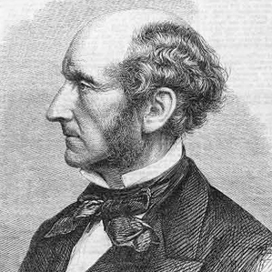

**SATURDAY, MARCH 2, 2013**

Freespeech and conversing with someone from the 1800s 
=================

Just read the cover story from the just arrived [MIT Technology Review](http://www.technologyreview.com/featuredstory/511276/free-speech-in-the-era-of-its-technological-amplification/)

What I actually found more interesting than the author's position on the "sunny compromise" (the way that companies like Google etc attempt to keep a balance between free speech and local national law obedience ) was the authors presentation of the article as a conversation with a two century old philosopher/writer, [John Stuart Mill](http://en.wikipedia.org/wiki/John_Stuart_Mill)  (feeling rather illiterate that I never read about the  "the most influential English-speaking philosopher of the nineteenth century".
If you think it through, if you want to explain to someone else who is an advanced thinker of their own time, not an average joe, today's technological advances like computers, internet, social networks etc.. its not by breaking things into basics. It is instead by understanding the most advanced contemporary ideas, innovations and discoveries that the person would be aware of and describing how those ended evolving or not into today state of affairs. It is hard because we very quickly lose the historical sense of what was conventional wisdom, what was accepted, debated or rejected and how that understanding varied as you change the population context from oxford's academics to early inventor circles etc..

_Posted at 8:17 AM_