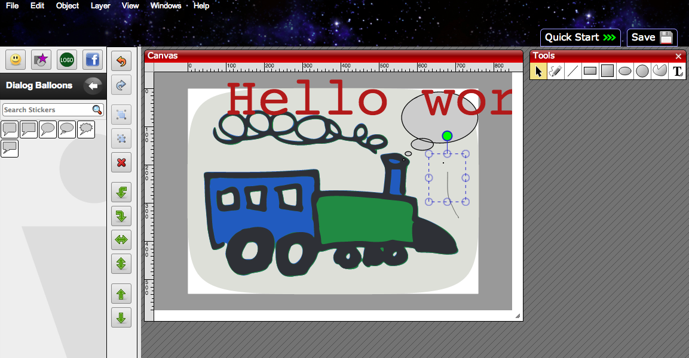

**THURSDAY, MARCH 14, 2013**

Is my dump illegal? 
=================

As I was looking at the whole [picture for the repository idea](adding-pictures-to-my-repos.md) - the realization struck me.
I mean its obvious - I just hadn't realized it. Using google found images to embed into a private article to make it look more interesting is ok - but my posts aren't any more private. I mean nobody reads them, I have disabled inclusion in search engines - but still they are public. And the repositories are public and _social_. Which means that the inclusion of the pictures I have found in google is propbably violating someone copyright. Which means that if that someone is disney - they probably have already robots scanning the web for the existence of any of their pictures anywhere and then the contact the site host (blogger?) and will ask them to shut me down. I will wake up a morning with my personal - all but private blog disabled and a ceast and desist mail in mailbox...
Ooops.
I don't want to worry about that.. (my mind just forked a thread - my kids keep snaping pictures they find and sharing them with eachother at instagram - how come that is legal ... I guess they are not public and even though instagram enables practically the sharing of millions of copyrightes pictures by virtue of the fact that this happens behind the privacy of a social circle they are protected... interesting)

Anyway how about buying cliparts.... found clipartof.com  Wow, amazing variety and great tagging - it seems that this is even more useful than google images. And they charge $5 ...no $10 for a blog size photo. It seems a bit of too much for too little.. - fork - I remember spending $250 buying a collection of clipart from my puny balance when I started OD to create the website and when later the marketing dept came... they said I couldn't use it because I couldn't find proof of license!... Not only you have to pay money ... you have to keep for ever an archive of your receipts and licenses... its unreal..
No, even though browsing a clipart gallery seems to be actually a better approach than working with someone to draw for you what you may (or may not) have in your imagination.. it just doesn't satisfy me. Plus I feel like a sucker to be paying $10 for a clipart copy of a blog that I spent 10 minutes "dumping".

So what to do. 
Looking for "open source" libraries...http://openclipart.org/.. looks kind of decent
You can even edit online the photo

20 minutes later - quite impressed about the capabilities (and the interesting use-case optimization ) of  the online photo editor/imagebot but convinced that I am an awful illustrator (the train above isn't mine) and the variety of the free clipart libraries is too small and I still cannot tell if I need to prove that I am allowed to use that pic...

So back to the original idea - hire someone in OD - not only for pictures of the public repos but for pictures in all my blog posts.. (it may cost less at OD to get custom art than buying a copy from clipartof ... ). Of course if I spend money for the pictures - maybe I should have an editor do some minimal typo english fixing - I feel embarrassed every time I read my posts from how I write..

Of course doing that would have been so much simpler if my posts were github files - I could hire multiple people have them pointed to the blog posts and asks for edits as pull requests - (somehow that feels so much better than adding every random person I hire as a co-author in my blog...)..
Where did I got stuck and did the blog in blogger... it is doable...
fork - I shouldn't change the english - it is a dump of how my brain things - the errors - the occasional (or omnipresent) incoherency is how my thought looks like - and thats what I want to persist in this blog.

As I was saying to a friend there are tweets - badly syntaxed - full of typos - pseudo english 140 char sentences, and then there are blog posts...Well written, syntaxed pages/stories.
My blog post is a dump - neither a tweet nor a blog post.. it is as raw and immediate as a tweet but as long as thought thread wants to be -.... tweets, dumps and blogs... Thats it.
Where was I - I feel my stack is about to overflow (stack overflow ;-) ) too many open threads (I have to decide am I out of workin set memory from too many threads or out of stack-segment space (stack overflow --these things used to be diff ulimits in unix.. -- I have to stop - I keep on forking.

_Posted at 10:17 PM_