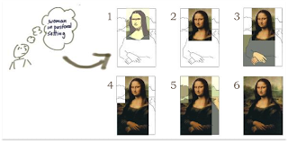

**THURSDAY, MARCH 7, 2013**

Iterative pipelined work 
=================

Magic:

You first open up something that looks like paint program, 
you draw a stick figure

Within 10 seconds as you draw a second frame shows where you are watching in realtime another screen - where an illustrator programis tracing your stick figure and coverts to a professional looking sketch. Within a few seconds yet another frame shows where a 3rd screen appears where someone is using Photoshop and he adding coloring, texture shade, on the second person's sketch. As you stop you see the illustrator drawing not stopping expanding - as if they were playing drawing ping pong with you trying to figure out what you had in your mind. As you the person he draws you realize that he drawing a man - you meant this to be a child. You add some short a caption - child asking and you add some more in the context - the illustrator goes back and quickly changes the faces and body proportions to child like - while the photoshop guy repaints the walls with pastel colors.

Reset.

You open up what looks like an editor and give the summary of an algorithm.
Within 10 second a second editor window shows where you are watching a person following
creating the basic functional blocks of the algorithm you are describing putting a simple comment on top of each function. By the time you are done - that person is already in the primary function starting coding it. You click into their editor and change the commend of a certain function that you want to have a different result. You also comment on the side- that you want the utility functions and the test code separately.
As the second editor is starting to restructure the code template using the modified instructions you see a third window, starting filling-in some of the simpler functions and within another 10 seconds a forth window adds plugs/passes in all the functions, opens up an interactive console and checks for errors and goes ahead and start writing test functions.

Reset.

You start a hangout, and soon after that 4 people join the hangout. You start presenting them the idea.
The participants seem to be typing busily - and you see in the side the transcript of your text appear in a google doc - You can see clearly 3 userid filling alternating pipelined following you phrase by phrase. With each phrase of yours a new cursor starts while the last one continues typing what you have already said. As you are talking faster and faster you are seeing soon 3 cursors concurrently  typing chasing you. A fourth cursor, follows fixing typos, adding newlines commas etc.
Within a few minutes you see a fifth person opening the document - not the hangout. You see the whole content formated, paragraphs, section titles added, your own - non-oral mistakes corrected and reworded.

_Posted at 10:53 PM_