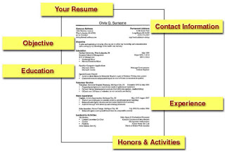

**WEDNESDAY, MARCH 6, 2013**

Post online education era CV 
=================

I tried to picture the CV of a person in the post online education era and it looked rather different that today's linked in resume.

Instead of the education being at the bottom of the resume with a couple entries describing the degrees/universities, educational activity isn't part of the past. It is instead interlaced with all other activities in a continuous timeline.
It doesn't talk as much about degrees it talks about achievements, lessons, certificates obtained.
The lessons are specific  and clickable, "Marketplace design CS234, Stanford, Prof: J.R."
Clicking any of the courses would bring more detailed certifiable information about the achievement, grades, professor/TA comments, project links etc etc. There are courses from multiple universities.
There are internships. A timeline graph may also be shown that allows the reader to follow more prolonged activities, mentor-ships, board participation, organization memberships etc and the progress within each.
The other interesting thing is that "employment" relationships are shorter, overlapping with each-other with much less clear indication of full-time-ness.

The CV is interactive, almost like a filterable event feed. I can click checkboxes and see just one type of activity or search and filter only activities by location/category/engagement type etc.

Several CV timeline events link to public archives, be it blog posts, news articles, repositories or contributions.

_Posted at 11:50 PM_