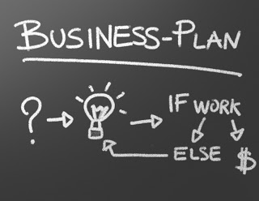

**THURSDAY, MARCH 7, 2013**

What is the "right" entrepreneur profile
=================

I was talking with a friend about creating a service that helps in some way people launch their site/service/product

The idea here is a vast audience of "startup makers" - people that are spending their time creating some new utility, site, service
- the vast majority of these efforts will never see the light of day,

    1. several never get off the discussion/brainstorming round, 
    2. some make it to the drawing board, sketches and workflows, 
    3. some make it to a blog/domain/launch page, 
    4. some make it to development, 
    5. some make it to an actual working product that the creator can actually use themselves , 
    6. some get to an alpha phase where the creator invites friends and fools, 
    7. some endup as a public utility that is public but doesn't full work, 
    8. some end up in a public site that works but is to expensive to just keep it 
    9. some have longevity but after obtaining some oxygen they quickly become irrelevant and forgotten 
    10. some end-up obtaining an audience that  persists and have a founder that is confortable to be putting the time/energy to keep the site up.

There are two opportunities here - one is to cater to the need of people to feel creators/founders/entrepreneurs - but do not build into your business model benefits when the entrepreneur succeeds. The other - which feels more morally correct - is to try to help people succeed and  rely on them to succeed for you to be successful.
In the beginning I was torn by the dichotomy above - but eventually I decided that there is no difference: a startup that helps wannabe entrepreneurs will have happy customers not when they do a successful startup - but when they manage to move ahead a step (see steps above) from where they normally get stuck. If you do that on aggregate you will improve the end-success rate of the funnel.

Anyway  the next argument was that people get stuck on a step because the next step is something that they really don't know/don't want to deal with.  A coder often doesn't want to deal with IT stuff, deployment and such, a back end developer doesn't want to deal with UI, design of the product and will make the api but not the end user product, a front end guy will never the backend - and he will keep on making "prototypes".. and the thing happens across more varied personality types, programmer guy, product guy, marketing guy, business guy. Not only that - but each one of them sees all the complexity of their own world but minimizes the complexity of the rest of the world - miscalculating the corners that need to be turned to get to the end. While the programmer may understand that they need programming and IT, the product guy, simply feels that they need a technical guy, and possibly the business guy things that he needs a technical product guy.

The next argument was that these audiences are very different - they almost represent different markets/products. If you browse sites like [cofounderslab.com](http://www.cofounderslab.com/) and try to understand where the various guys come from its all over the place. A service/product that tries to help programmers launch startups is quite different from a service/product that tries to help business folks launch startups.
On the other hand a programmer is known to have time but not money but a business is expected to have or to be able to able find easier money. Plus the conventional wisdom was that programmers aren't good at understanding business value... Plus programmers that are thinking of a startup are fewer than business folks that are thinking of a startup (browsing the cofounderslab seem to argue that too- there are more people looking for programmers than programmers looking for business people..).

Unfortunately the above is against what I was thinking of doing. My (hopeful) view is that the old conventional wisdom are wrong. Technical folks, people that come with cs degrees as opposed to business degrees, that know to code as opposed to make powerpoints are taking over the startup world. Their population grows disproportionally, because the world needs much more of them than it needs business people - they are the new pro-sumer class (in the programmer-consumer sense). They are not like the last decade programmer stereotype, antisocial/caveman not knowing marketing etc. Githubs and  stackoverflow has made them more social/connected. This newer much more attractive stereotype of the "github geek: has attracted scores of converts - and that has made the whole trend further grow etc etc.

So the service I want to do is a service that targets programmers. and it should be providing what programmers don't want to be dealing with. And that is....

_Posted at 10:06 AM_