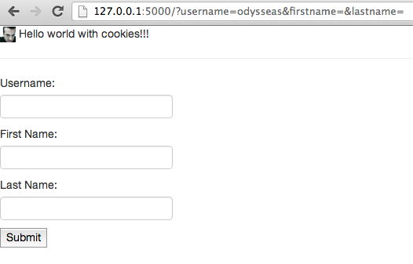
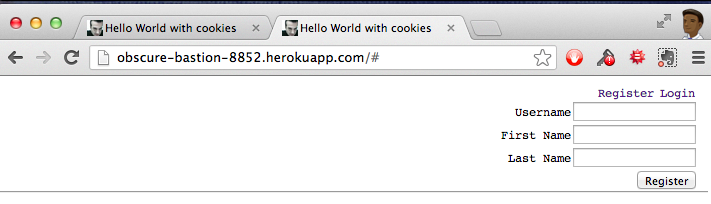

**FRIDAY, MARCH 1, 2013**

Work notes - helloworld with cookies
=================

02/23/2013..
The plan here is to use cookies to save something useful, something that resembles the signup information.
How about the user provided inputs
 - username
 - first name
 - last name
Ok, there is even a semi ready form for that somewhere,.. yes passport-local. Copied that, changed it a bit, appeneded at the end of my hello world.
Oops, problem. Can I submit a form?. It seems I get an error. Should I attempt to grab the user info myself - e.g. by change the method to get from post and parsing the string and the destination to /.. or should I add express as a minimal routing middleware. Lets try the do it yourself approach first.



Ok - not an error any more and I see the url params. good. Seems I made the right choice. Of course it doesn't refill in the form the parameter in the url.


Lets how I can get the url params from the server side. It seems that the connect-query does just that - it creates the req.query object.

Lets add it. Added it. Hmm,... now where do I put the code for this to do something.... darn, still I need some url receiving place ie a route.

Its not right to just add this as a middleware function. How does gl does it. He is using express.. should I bite the bullet and use express? already? and do I need connect.query then? or express does this for me?

Looking at the express documentation it seems that express adds connect with cookies and qs, qs could be sth like query
http://expressjs.com/guide.html

```
$ npm ls
hello-world@0.0.1 /private/tmp
└─┬ express@3.0.0beta7
  ├── commander@0.6.1
  ├─┬ connect@2.3.9
  │ ├── bytes@0.1.0
  │ ├── cookie@0.0.4
  │ ├── crc@0.2.0
  │ ├── formidable@1.0.11
  │ └── qs@0.4.2
  ├── cookie@0.0.3
  ├── debug@0.7.0
  ├── fresh@0.1.0
  ├── methods@0.0.1
  ├── mkdirp@0.3.3
  ├── range-parser@0.0.4
  ├─┬ response-send@0.0.1
  │ └── crc@0.2.0
  └─┬ send@0.0.3
    └── mime@1.2.6
```

```
> npm ls
└─┬ connect@2.7.3
  ├── buffer-crc32@0.1.1
  ├── bytes@0.2.0
  ├── cookie@0.0.5
  ├── cookie-signature@0.0.1
  ├── debug@0.7.2
  ├── formidable@1.0.11
  ├── fresh@0.1.0
  ├── pause@0.0.1
  ├── qs@0.5.1
  └─┬ send@0.1.0
    ├── mime@1.2.6
    └── range-parser@0.0.4
```

!.. Interesting! I already have cookies and this qs things. But why cookies. Maybe because static needs it to keep track of information about file dates etc? maybe. No need to know really (yet). Lets find what is this qs thing..

03/02/2013. Ok One week later with barely any time for serious work in between , still with several micro-iterations I am pushing my final version of this iteration



Register works and Logout  work - I also made the whole thing look a bit more like what I had in mind originally.
Decisions made along the way
- Used dglittle's libraries from [https://github.com/dglittle/nar-nar](https://github.com/dglittle/nar-nar)
  + u.js
  + rpc.js
  + nodeutil.js
- Used dglittle index.html base code. This includes
  + the client side of rpc.js,
  + the coding style/methodologie
- Added express's routes, and connect's cookie parser - plus all the prior middleware
- Implemented a few basic rpc methods (register,logout,getuser) and used a single file index.html as the client side driver.

```
    * Here is the github repo : [https://github.com/ogt/helloworld-node-cookies](https://github.com/ogt/helloworld-node-cookies)
    * Here is the heroku app : [http://obscure-bastion-8852.herokuapp.com/](obscure-bastion-8852.herokuapp.com) (20+ sec delay at first fetch)
    * Here is the blog post about this : [http://otdump.blogspot.com/2013/03/worknotes-helloworld-with-cookies.html](../03/worknotes-helloworld-with-cookies.md)
```

_Posted at 9:07 PM_